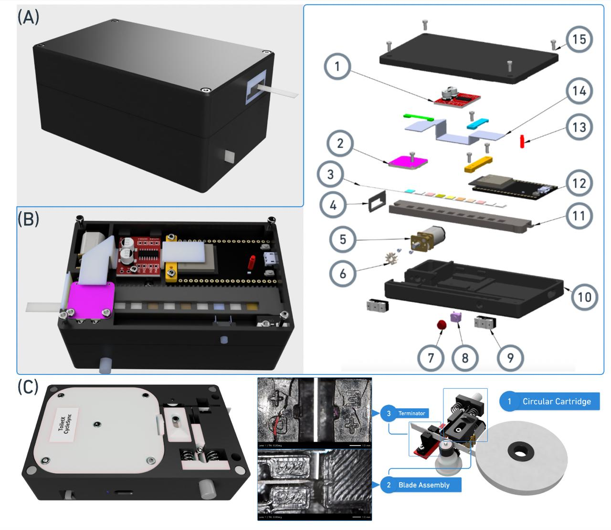
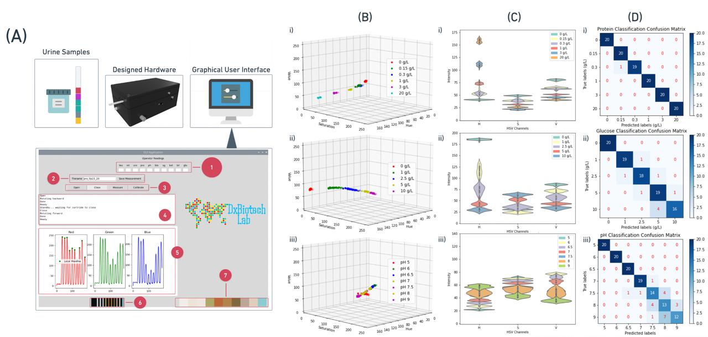
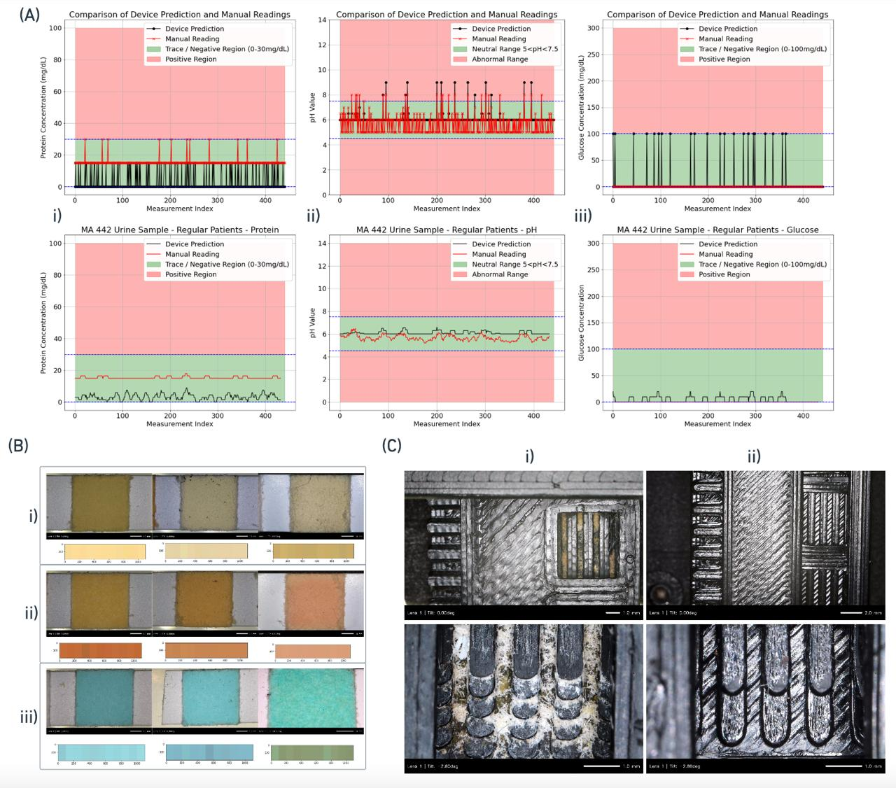

# 💧 POC Urine Dipstick Analyzer

  

We introduce a **point-of-care (POC) platform** that enables **continuous, rapid, and on-demand urine analysis**. The portable system integrates two major modules:

1. 🧾 **On-Demand Dipstick Dispenser** – Releases dipsticks ticket-style for the user.
2. 🧪 **Automated Colorimetric Analyzer** – Rapidly reads test results once the dipped strip is reinserted.

### 📲 Results:
- Generated **within seconds**.
- Delivered via a **mobile app**.
- Stored and timestamped for **longitudinal tracking** and **data-informed decision making**.

---

## ⚙️ Electronics & Components

- **RGB Sensor:** TCS34725 (AMS)
- **Microcontroller:** ESP32 (Espressif Systems)
- **Motors:** 2× 6V 100 RPM micro DC motors
- **Motor Driver:** MX1508 dual H-channel
- **Additional:** Linear actuator, IR sensor, electromechanical buttons, end-switch, and LED indicators

---

## 🧰 System Design

**(A)** Full device render: lightweight and user-friendly  
**(B)** Analyzer internals (with labeled components)  
**(C)** Dipstick dispenser design and separation mechanism  

RGB measurements are wirelessly transmitted to a mobile application for storage and result visualization.

---

## 📊 Experimental Results & Data Insights

- **(A)** HSV color values from 900 measurements (protein, glucose, pH)
- **(B)** Violin plots showing volatility and separability of readings
- **(C)** K-means confusion matrices revealing prediction accuracy per analyte

---

## 📈 Longitudinal Tracking & Performance

- **(A)** Simulated 1-year tracking using healthy urine samples (442 entries)
- **(B)** Comparison of sensor results across 3 dipstick storage conditions
- **(C)** Real-world reservoir use cases with long-term reliability

---

## 📦 Application Potential

- **Chronic condition monitoring** (e.g., diabetes, kidney function)
- **Remote diagnostics** via mobile interface
- **Non-invasive health insights** through automated, repeated measurements

---

## 🔒 License & Usage

This repository is provided **exclusively for portfolio and HR evaluation purposes**.  
**Do not use, distribute, or modify** without prior written permission.  
All rights reserved © 2025 [Your Name]

---
